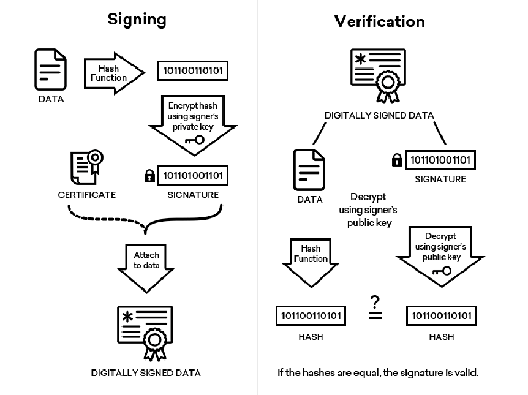

# Java Digital Signature Verification Engine

A production-ready Java implementation demonstrating the asymmetric cryptography workflow for creating and verifying digital signatures. This project mirrors standard Information Technology security protocols used to ensure data integrity, authenticity, and non-repudiation.

## 📌 Project Overview

This repository contains a clean, self-contained implementation of a cryptographic digital signature engine using Java's native `java.security` libraries. It visualizes and executes the end-to-end process of document signing and verification through asymmetric cryptography.

### How It Works (Workflow Diagram)
Below is the architectural workflow implemented by this algorithm:



1. **Signing Phase (Left):** Data is processed through a cryptographic Hash Function (`SHA-256`) to produce a unique message digest. This hash is then encrypted using the signer's **Private Key** to generate the unique **Digital Signature**.
2. **Verification Phase (Right):** The recipient hashes the received data independently. Simultaneously, they decrypt the digital signature using the signer's corresponding **Public Key**. If both hashes are exactly equal, the signature is validated, proving the data has not been tampered with.

---

## 🛠️ Technologies Used

* **Language:** Java (JDK 8 or higher)
* **Cryptographic Framework:** `java.security` API
* **Algorithms:** * **RSA (2048-bit):** Used for asymmetric key pair generation and encryption/decryption of the hash.
  * **SHA-256:** Used as the secure message digest hash function.

---

## 🚀 How to Run It

Since this project relies completely on Java's core library package, no external dependencies or build tools (like Maven or Gradle) are strictly required.

### Prerequisites
* Java Development Kit (JDK) 8 or higher installed.

### Execution Steps
1. **Clone the repository:**
   ```bash
   git clone [https://github.com/SoheibKaddouri/algorithms.git](https://github.com/SoheibKaddouri/algorithms.git)
   cd algorithms/digital-signatures

2. **Compile the Java File:**

```bash
javac DigitalSignatureDemo.java
```

3. **Run the Application:**

```bash
java DigitalSignatureDemo
```

## Expected Output
The application runs two execution scenarios: one with original untampered data, and one where the data is maliciously modified after signing.

--- STARTING DIGITAL SIGNATURE PROCESS ---
Original Data: Hello, this is a secure message!
Signature Generated (Hex): 3a2f89b1cde405... [truncated]

Verification 1 (Untampered Data)
Does the calculated hash match the decrypted signature hash? -> **true**

Verification 2 (Tampered Data)
Does the calculated hash match? -> **false**

## 🧠 Challenges Overcame
1. **Abstracting the Dual-Step Process Natively**
   - In mathematical theory, digital signing requires explicitly running a hash function first, and then feeding that hash into an RSA encryption cipher. In Java, managing these two states manually can introduce security vulnerabilities (such as incorrect padding or initialization vectors).
   - **Solution:** I overcame this by leveraging Java's highly optimized Signature class with the wrapper standard instance "SHA256withRSA". This natively pairs the message digesting and asymmetric cipher operations securely under a unified engine.
2. **Simulating Real-World Tampering**
   - To fully test the verification logic, I needed to simulate a malicious interceptor. Hardcoding static byte checks would not reflect algorithmic accuracy.
   - **Solution:** Built a dynamic verification routine that modifies the string payload after the signature generation phase. This successfully proved that changing even a single character breaks the hash matching condition, asserting the algorithm's strength in detecting data tampering.
